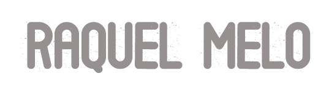
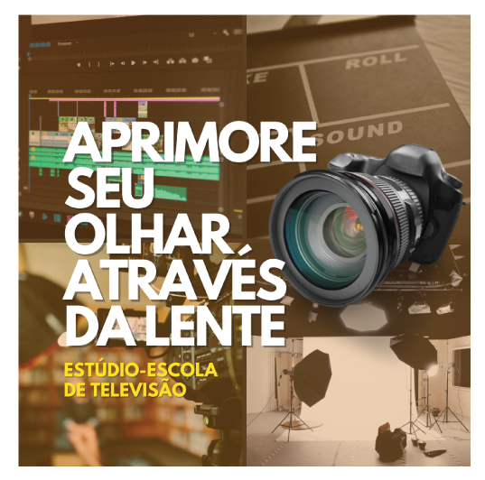
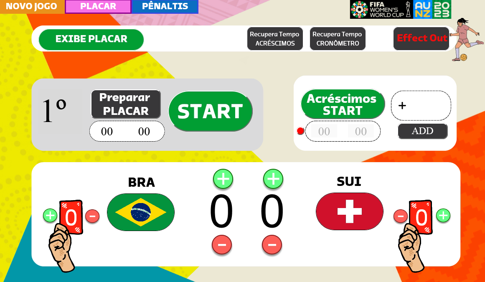
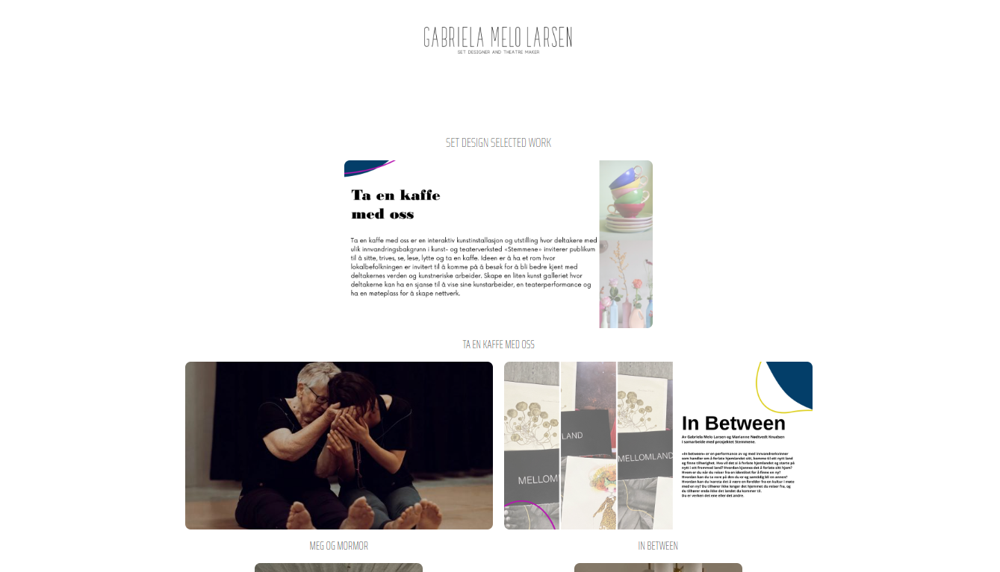

<!DOCTYPE html>
<html class="no-js" lang="en">
<head>

    <!--- basic page needs
    ================================================== -->
    <meta charset="utf-8">
    <title>Raquel MeloA</title>
    <meta name="description" content="">
    <meta name="author" content="">

    <!-- mobile specific metas
    ================================================== -->
    <meta name="viewport" content="width=device-width, initial-scale=1">

    <!-- CSS
    ================================================== -->
    <link rel="stylesheet" href="css/base.css">
    <link rel="stylesheet" href="css/vendor.css">
    <link rel="stylesheet" href="css/main.css">

    <!-- script
    ================================================== -->
    
    

    <!-- favicons
    ================================================== -->
    <link rel="apple-touch-icon" sizes="180x180" href="apple-touch-icon.png">
    <link rel="icon" type="image/png" sizes="32x32" href="favicon-32x32.png">
    <link rel="icon" type="image/png" sizes="16x16" href="favicon-16x16.png">
    <link rel="manifest" href="site.webmanifest">

</head>

<body id="top">

    

        

    

    <!-- site header
    ================================================== -->
    <header class="s-header">

        

            
            </a>
        

        <nav class="header-nav-wrap">
            <ul class="header-main-nav">
                <li class="current"><a class="smoothscroll" href="#intro" title="intro">Olá!</a></li>
                <li><a class="smoothscroll" href="#about" title="about">Sobre mim</a></li>
                <li><a class="smoothscroll" href="#services" title="services">Habilidades</a></li>
                <li><a class="smoothscroll" href="#works" title="works">Trabalhos</a></li>
                <li><a class="smoothscroll" href="#contact" title="contact us">Contato</a></li>	
            </ul>

            <ul class="header-social">
                <li><a href="#0"><i class="fab fa-facebook-f" aria-hidden="true"></i></a></li>
                <li><a href="#0"><i class="fab fa-twitter" aria-hidden="true"></i></a></li>
                <li><a href="#0"><i class="fab fa-dribbble" aria-hidden="true"></i></a></li>
                <li><a href="#0"><i class="fab fa-behance" aria-hidden="true"></i></a></li>
            </ul>
        </nav>

        <a class="header-menu-toggle" href="#">Menu</a>

    </header> <!-- end s-header -->

    <!-- intro
    ================================================== -->
    <section id="intro" class="s-intro target-section">

        

            

                <h3>Olá!</h3>
                <h1>
                    Designer,  
                    Videografista  
                    e Desenvolvedora  
                    entusiasta.
                </h1>
            

            

                <a href="#about" class="intro-scroll-link smoothscroll">
                    Leia mais abaixo
                </a>
            

            

            

        
 <!-- end row -->

    </section> <!-- end intro -->

    <!-- about
    ================================================== -->
    <section id="about" class="s-about target-section">

        

            

                

                    <h2 class="section-heading">Sobre mim</h2>
                

            

            

                

                    

                    Profissional altamente qualificada com uma ampla experiência no mercado audiovisual, 
                    com mais de 10 anos de atuação. Formada em Produção Audiovisual e uma pós-graduação 
                    em Desenvolvimento Web Full Stack, e atualmente estou cursando Engenharia de Software para expandir ainda mais 
                    minha base de conhecimento.
                    

                    

                    Minha carreira no mercado audiovisual foi marcada por contribuições significativas, incluindo trabalhos 
                    notáveis na TV Globo, onde participei de importantes eventos como Eleições, Copas do Mundo Masculina e 
                    Feminina, Rock in Rio e muitos outros. Além disso, estive envolvida em produções variadas, desde telejornais 
                    até programas de variedades e o Big Brother Brasil (BBB).
                    

                    

                    Possuo conhecimentos avançados em diversas ferramentas, incluindo o pacote Adobe (After Effects, Premiere, 
                    Photoshop, Illustrator e Adobe XD), o software Chyron Lyric, Figma, WordPress, Elementor e Da Vinci. Nos 
                    últimos anos, dediquei-me ao desenvolvimento, adquirindo habilidades em linguagens como JavaScript, Python, 
                    Java e VBScript, que são fundamentais para os softwares de produção que utilizo. Também adquiri conhecimentos 
                    em UX/UI e gestão de otimização de tempo.
                    

                    

                    Sou uma entusiasta de novas tecnologias e estou sempre disposta a aprender mais, o que me permite permanecer 
                    atualizada em um ambiente profissional em constante evolução. Combinando minha experiência sólida em produção 
                    audiovisual com minhas habilidades em desenvolvimento e design, estou preparada para enfrentar desafios e 
                    contribuir de forma significativa em qualquer projeto ou equipe em que me envolva.
                    

                

            

    

        
 <!-- end about-me -->

        

            

                

                    <h2 class="section-heading">Trabalho e Educação</h2>
                

            

            

                

                    

                        

                            
                        

                        

                            

                            

                                
Abril 2022 - Present

                                <h3 class="item-title">Tv Globo</h3>
                                <h5>Editora de Videografismo</h5>
                            

                            

                                
Uso avançado de ferramentas como Adobe After Effects, 
                                Premiere, Photoshop e Illustrator, criar animações e
                                efeitos visuais de alta qualidade. Uso de softwares 
                                especializados, como Chyron Lyric, Viz Artist e Viz Trio, 
                                que desempenham um papel crucial na produção de gráficos 
                                em tempo real para ransmissões ao vivo.

                            

                        

                        

                            

                            

                                
Maio 2012 - Março 2022

                                <h3 class="item-title">Tv Globo</h3>
                                <h5>Operadora de Videografismo</h5>
                            

                            

                                
responsável por criar gráficos, animações, 
                                efeitos visuais e outros elementos que serão 
                                integrados ao conteúdo audiovisual. Incluindo 
                                gráficos informativos, logotipos, títulos, 
                                animações de transição e mais. Garantindo 
                                que o conteúdo seja informativo, atraente e 
                                profissionalmente apresentado. 

                            

                        

                    

                

                

                    

                        

                            
                        

                        

                            

                            

                                
Setembro 2022- Março 2023

                                <h3 class="item-title">Universidade Anhanguera</h3>
                                <h5>Pós-Graduação em Desenvolvimento Web Full Stack</h5>
                            

                            

                                
Compreender os padrões e tecnologias essenciais 
                                para o desenvolvimento de soluções Web para 
                                diferentes ramos de negócio. Compreender, 
                                planejar e construir arquiteturas web com 
                                metodologias e tecnologias atuais e potentes.
                                Planejar, organizar e gerir equipes de projetos 
                                de desenvolvimento Web com qualidade, em conformidade 
                                com a cultura DevOps. Compreender e aplicar os conceitos 
                                e modos de integração com soluções de big data e cloud computing.
                                Desenvolver soluções de software por meio de frameworks front end 
                                e back end, com a adoção de boas práticas amplamente utilizadas na 
                                indústria de desenvolvimento de software.

                            

                        

                        

                            

                            

                                
Agosto 2016 - Junho 2020

                                <h3 class="item-title">Universidade Estácio</h3>
                                <h5>Graduação em Produção Audiovisual</h5>
                            

                            

                                
Capaciitação para produzir programas audiovisuais.
                                Incluindo toda a produção, concepção do roteiro, como escolher 
                                as melhores locações dos espaços e também produção executiva.

                            

                        

                        

                            

                            

                                
Agosto 2004 - Agosto 2009

                                <h3 class="item-title">Universidade Federal do Rio de Janeiro</h3>
                                <h5>Licenciatura em Educação Artistica | Desenho</h5>
                            

                            

                                
Formação em Desenho visando o conhecimento da geometria (plana e projetiva) 
                                e a sua aplicação às diferentes técnicas de representação gráfica.

                            

                        

                    

                

            

        
 <!-- end about-experience -->

    </section> <!-- end s-about -->

    <!-- services
    ================================================== -->
    <section id="services" class="s-services ss-dark target-section">

        

        

            

                <h2 class="section-heading section-heading--centerbottom">Habilidades</h2>

                

                    Sempre há algo novo a aprender.
                

            

        
 <!-- end heading-block -->

        

            

                

                    <h4 class="item-title">Videografismo | Motion Design</h4>
                    

                    Especialização em motion design e videografismo.
                    Alta proficiência no software Chyron Lyric, 
                    para produção de gráficos em tempo real.
                    Participação em eventos de grande porte, como Eleições e Copas do Mundo.
                    Trabalho em telejornais, programas de variedades e eventos ao vivo.
                    

                

            

            

                

                    <h4 class="item-title">Ferramentas Adobe</h4>
                    

                        Proficiência avançada no pacote Adobe, 
                        incluindo After Effects, Premiere, Photoshop 
                        e Illustrator.
                    

                

            

            

                

                    <h4 class="item-title">Desenvolvimento Web Full Stack</h4>
                    

                    Habilidades em front-end, incluindo HTML, CSS, JavaScript e frameworks como React;
                    Experiência em desenvolvimento de aplicações
                    

                

            

            

                

                    <h4 class="item-title">Ferramentas de Design de Prototipagem | Desenvolvimento</h4>
                    

                    Proficiência em ferramentas de design, como Figma.
                    Experiência em criação e personalização de sites usando WordPress e Elementor.
                    

                

            

            

                

                    <h4 class="item-title">Gestão de Tempo e Otimização</h4>
                    

                    Estudos em gestão de otimização de tempo.
                    Habilidades para organizar e otimizar processos de trabalho.
                    

                

            

            

                

                    <h4 class="item-title">Aprendizado Contínuo e Entusiasmo por Tecnologia</h4>
                    

                    Dedicação à aprendizagem contínua, incluindo cursos em JavaScript, 
                    Python, Java e VBScript.
                    Interesse e entusiasmo por novas tecnologias e tendências em design, 
                    desenvolvimento e produção audiovisual.
                    

                

            

        
 <!-- end services-list -->

    </section> <!-- end s-services -->

    <!-- works
    ================================================== -->
    <section id="works" class="s-works target-section">

        

            

                <h2 class="section-heading section-heading--centerbottom">Trabalhos</h2>
            

        
 <!-- end heading-block -->

        

            

                

    
                

                    

                        

                            <video width="640" height="480" controls="controls">
                                <source src="videos/EDIT_MINHA PRECE.mp4" type="video/mp4">
                                <object data="" width="640" height="480">
                                <embed width="640" height="480" src="videos/EDIT_MINHA PRECE.mp4">
                                </object>
                                </video>
                        

                        

                            <a href="" class="thumb-link" title="Shutterbug" data-size="1x1">
                                <source src="videos/EDIT_MINHA PRECE.mp4" type="video/mp4">
                            </a>    
                            
                        

    
                        

                            <h4 class="item-folio__title">
                                Lyric Video
                            </h4>
                            

                                Minha Prece - Dandara Manoela - After Effects | Premiere
                            

                        

    
                        

                            
After Effects | Premiere

                        

                    

                
 <!-- end masonry__brick -->
    
               
                

                    

                        
                        

                            
                            
                            
                        

                        

                            <h4 class="item-folio__title">
                                Board Logo 
                            </h4>
                            

                                Estúdio escola de TV - Illustrator | Photoshop
                            

                        

                        

                            
Logomarca, Projeto Gráfico e digital

                        

                    

                
 <!-- end masonry__brick -->

                

                    

                        

                            
                            
                        

                        

                            <h4 class="item-folio__title">
                                Interfaces operacionais
                            </h4>
                            

                                Copa do Mundo - Figma | HTML | CSS | VBScript
                            

                        

                        

                            
 Interfaces interativas de videografismo

                        

                    

                
 <!-- end masonry__brick -->

                

                    

                            
                        

                            
                            
                        

                        

                            <h4 class="item-folio__title">
                                Set Designer Logo & Site
                            </h4>
                            

                                Web Design - Figma | Illustrator | Wordpress | Elementor
                            

                        

                        

                            
Concepção de Logo e Site com portfolio

                        

                    

                
 <!-- end masonry__brick -->
        
                

            
 <!-- end masonry -->

        
 <!-- end masonry-wrap -->

    </section> <!-- end s-work -->

    <!-- contact
    ================================================== -->
    <section id="contact" class="s-contact ss-dark target-section">

        

            

                <h2 class="section-heading">Entre em contato</h2>
            

        

        

            

                

                    <a href="mailto:#0">raqlsmelo@gmail.com</a>
                

                

                Aberta a novas possibilidades, novos apendizados e
                novas experiências.
                <a href="mailto:#0">Envie um email</a>.
                

            

        

        

            

                <h4>Telefone</h4>
                <a href="tel:197-543-2345">+ 55 21 9766 02418</a>
            

        
 <!-- end contact-infos -->

    </section> <!-- end s-contact -->

    <!-- footer
    ================================================== -->
    <footer>
        

            

                © Raquel Melo - 2023 
                
            
            

            

                
            

        

    </footer>

    <!-- photoswipe background
    ================================================== -->
    

        

        

            

                

                

                

            

            

                

                    

<button class="pswp__button pswp__button--close" title="Close (Esc)"></button> <button class="pswp__button pswp__button--share" title=
                    "Share"></button> <button class="pswp__button pswp__button--fs" title="Toggle fullscreen"></button> <button class="pswp__button pswp__button--zoom" title=
                    "Zoom in/out"></button>
                    

                        

                            

                                

                            

                        

                    

                

                

                    

                
<button class="pswp__button pswp__button--arrow--left" title="Previous (arrow left)"></button> <button class="pswp__button pswp__button--arrow--right" title=
                "Next (arrow right)"></button>
                

                    

                

            

        

    
<!-- end photoSwipe background -->

    <!-- Java Script
    ================================================== -->
    
    
    

</body>
